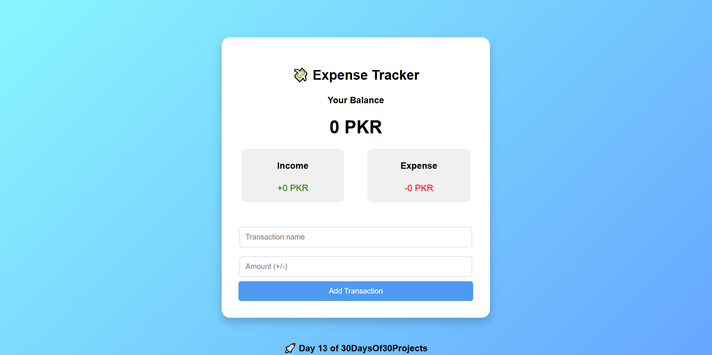

# 💸 Expense Tracker

A **simple, clean, and functional** expense tracker app built with HTML, CSS, and JavaScript.

<br>

📸 Screenshots


<br>

## ✨ Features

- 📥 **Add transactions** (income or expense)
- 💰 **Real-time balance update**
- 📊 **Income vs. expense summary**
- 📝 **Transaction history list**
- 🌐 **Responsive & user-friendly interface**

<br>

## 💻 Built With

- **HTML** – Structure  
- **CSS** – Styling & layout  
- **JavaScript** – Logic, DOM updates, array handling

<br>

## 🚀 How to Run

1️⃣ Clone the repo:
```bash
git clone
```
2️⃣ Open index.html in your browser.

3️⃣ Start adding transactions and watch your balance update live!

<br>