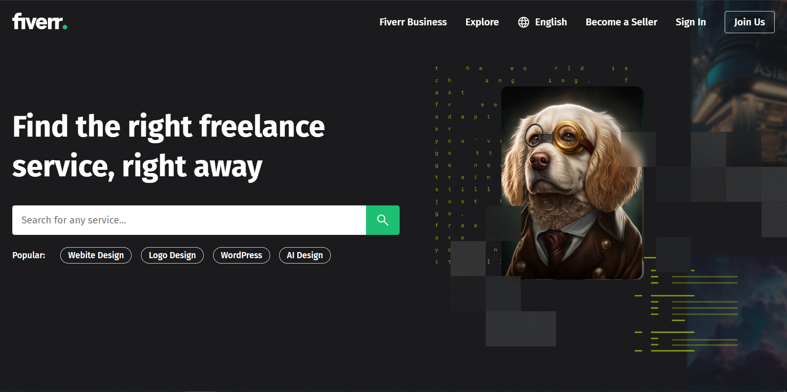

# 🌐 Day 10: Fiverr Landing Page Clone

A responsive and clean **landing page clone of Fiverr** built using **HTML, CSS, and JavaScript**.  
This project mimics Fiverr’s header and hero section with a custom design, animated mobile navigation, and search form.

 

## 💡 Features

- 🖼️ Hero section with background image and search form
- 📱 Fully responsive navigation with hamburger menu
- 🌐 Mobile menu with animated slide-in effect
- 💻 Clean UI similar to Fiverr’s landing page
- 🎨 Custom styling with hover effects and transitions

 

## 📁 Files Included

- `index.html` – Structure of the landing page  
- `style.css` – Styling, layout, and responsive design  
- `script.js` – Mobile menu toggle functionality

 

## 🚀 How to Run

1. Clone or download the repository  
2. Open `index.html` in any modern browser  
3. Interact with the UI and try resizing to test responsiveness

 

## 📸 Preview

>

 

> Created with 💚 by [Mubeen Channa](https://github.com/Mubeen-Channa)
