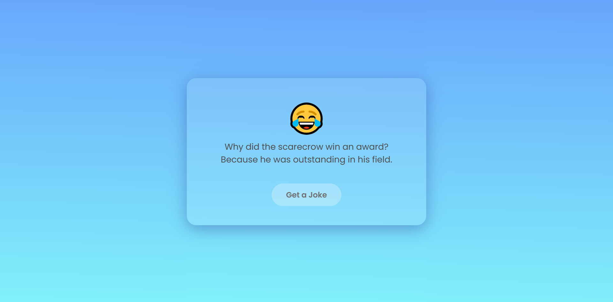

# 😂 Joke Generator

A fun web app that fetches random jokes from the [Official Joke API](https://official-joke-api.appspot.com) and displays them with a smooth, stylish UI.

 

## 📸 Screenshot

 

## 🚀 Features
- Fetch random jokes with one click
- Clean and responsive design using HTML, CSS, and JavaScript
- Smooth button animations and transitions
- Error handling if the API fails

 

## 💻 Technologies Used
- HTML
- CSS
- JavaScript (Fetch API)

 

## 🌐 How to Use
1. Clone this repository or download the files.
2. Open `index.html` in your browser.
3. Click **Get a Joke** — enjoy a laugh!

 

## 📡 API Reference
[Official Joke API](https://official-joke-api.appspot.com)

 

Feel free to fork, improve, or share!

