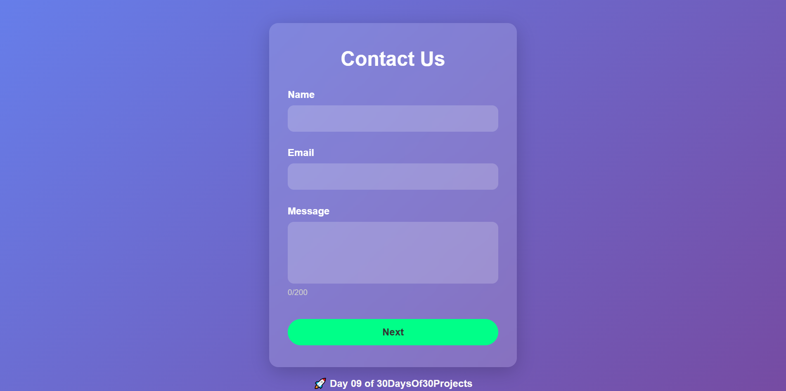

# 📬 Day 09: Multi-Step Contact Form

This project is a sleek **Multi-Step Contact Form** built using **HTML, CSS, and JavaScript**.  
It features input validation, a character counter, CAPTCHA verification, a loading animation, and a success modal — all within a clean, modern UI!

 

## 💡 Features:

- ✍️ Step-by-step form navigation (Next/Back)
- 🛡️ CAPTCHA challenge for spam prevention
- ✅ Real-time validation for inputs
- 🔢 Live character counter for message field
- ⏳ Loading animation before submission
- 🎉 Success modal popup after submission
- 🎨 Fully responsive design with glassmorphism effect

 

## 🛠 Built With:
- HTML5
- CSS3 (Glassmorphism + modern UI)
- Vanilla JavaScript

 

## 📸 Preview:

 

## 🚀 How to Use:
1. Clone the repository.
2. Open the `index.html` file in your browser.
3. Fill the form and test live!

 

## 📢 Improvements Possible:
- Add backend integration (Node.js, PHP, Formspree)
- Add email sending on successful submission
- Add step transition animations

 

## 🤝 Contributing:
Pull requests are welcome. Feel free to open issues for feature suggestions!

 

## 📬 Connect with Me:
- [LinkedIn](https://www.linkedin.com/in/mubeen-channa/)

 

> Built with ❤️ by [Mubeen Channa](https://github.com/Mubeen-Channa)