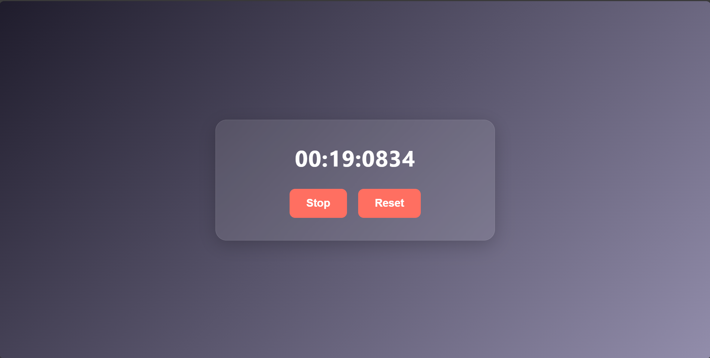

# ⏱️ Day 08: Stopwatch App

A sleek and functional **Stopwatch Web App** built with **HTML, CSS, and JavaScript**.  
It tracks time down to nanoseconds and provides a smooth user experience with start/stop and reset functionality.

 

## 💡 Features

- 🕒 Real-time stopwatch display
- 🔁 Start/Stop toggle
- 🔄 Reset button
- ✨ Glassmorphism-inspired UI
- ⏱️ Time display includes minutes, seconds, and nanosecond precision

 

## 📁 Files Included

- `index.html` – Structure of the stopwatch  
- `style.css` – Styling with a clean, modern design  
- `script.js` – Logic to start, stop, and reset the timer

 

## 🚀 How to Use

1. Clone or download the repo  
2. Open `index.html` in your browser  
3. Click **Start** to begin the timer, and **Stop** to pause  
4. Click **Reset** to clear the timer

 

## 📷 Preview

>

 

> Built with ❤️ by [Mubeen Channa](https://github.com/Mubeen-Channa)
